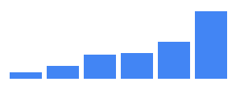
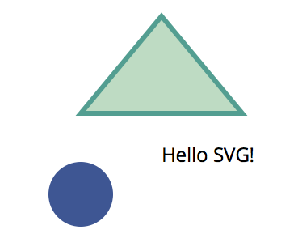
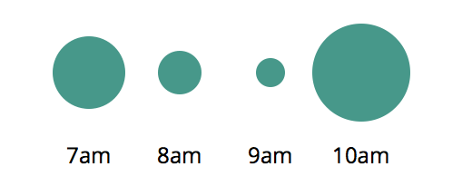
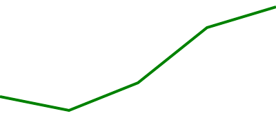
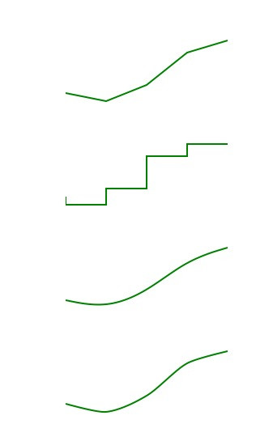

# Learn to Create D3.js Data Visualizations by Example
# 实例教学：使用 D3.js 实现数据可视化

原文链接：[Learn to Create D3.js Data Visualizations by Example](https://www.sitepoint.com/d3-js-data-visualizations/)

> D3.js is a JavaScript library for manipulating documents based on data. D3 helps you bring data to life using HTML, SVG, and CSS.


> 基于 [D3.js](https://d3js.org/) ，编写 HTML、SVG 和 CSS 就能让你的数据变得生动起来，这是一个基于数据操作 DOM 的 JavaScript 库。

There are only three JavaScript libraries that I would suggest every web developer should learn: jQuery, Underscore and D3. These are libraries that allow you to think about code in new ways: jQuery allows you to write less and do more with the DOM, Underscore (or lodash) gives you functional tools for changing the way you write programs and D3 gives you a rich tool-set for data manipulation and graphics programming. If you’re unfamiliar with D3 please take a moment to look at the impressive gallery of examples to see what can be done with it.

在我看来，每一位 Web 开发者最应该学习的三个 JavaScript 库就是 jQuery、Underscore 和 D3。在学习它们的过程中，你将会从新的角度去思考如何写代码：jQuery 让你知道如何用尽量少的代码，尽可能多地操作 DOM；Underscore （或者称之为 lodash）用函数式的工具改变你写程序的方式；而 D3 给了你大量的操作数据的工具，以及图形化编程的思想。如果你还不了解 D3，请花一些时间看看[它的例子](https://github.com/mbostock/d3/wiki/Gallery)，体会一下 D3 能做到什么。

**This aint’ your daddy’s charting library.**
**这可不是你老爸的图表库。**

William Playfair invented the bar, line and area charts in 1786 and the pie chart in 1801. Today, these are still the primary ways that most data sets are presented. Now, these charts are excellent but D3 gives you the tools and the flexibility to make unique data visualizations for the web, your creativity is the only limiting factor.

1786年 William Playfair 发明了柱状图、折线图和分区图，在1801年，他又发明了饼状图。虽然直到今天，数据可视化还是离不开它们。但在互联网时代，D3 能让你做出更酷更灵活甚至是独一无二的可视化效果，而你的创造力才是唯一的限制因素。

D3 is an extremely flexible low-level visualization library with a jQuery-like API for mapping data to HTML and SVG documents. It contains a wealth of helpful mathematical functions for data transformation and physics calculations, although most of it’s power comes from manipulating geometries and paths in SVG.

D3 有极高的灵活性，它是一个比较基础的可视化 js 库，api 和 jQuery 很像，可以把数据和 HTML 结构或者 SVG 文档对应起来。D3 有丰富的数学函数来处理数据转换和物理计算，它擅长于操作 SVG 中的路径 (path) 和几何图形 (circle, ellipse, rect...)。

This article aims to give you a high level overview of D3’s capabilities, in each example you’ll be able to see the input data, transformation and the output document. Rather than explaining what every function does I’ll show you the code and you should be able to get a rough understanding of how things work. I’ll only dig into details for the most important concepts, Scales and Selections.

这篇文章旨在给读者一个 D3 的概览，在接下来的例子里，你会看到输入的数据、数据变换和最后的输出文档。我将不会解释逐个函数做了什么，我会把代码展示给你看，希望从中你能知道大致这些代码是怎么工作的。只有在 [Scales](https://github.com/d3/d3-3.x-api-reference/blob/master/Scales.md) 和 [Selections](https://github.com/d3/d3-3.x-api-reference/blob/master/Selections.md) 的部分我才会重点解释。


## A Bar Chart
## 柱状图


（[codepen 中查看代码](http://codepen.io/SitePoint/pen/wWJXWa)）


I promised you more than William Playfair’s charts but making the humble bar chart with HTML is one of the easiest ways to understand how D3 transforms data into a document. Here’s what that looks like:

我说过在 D3 中，你能使用到的图表远比 Playfair 先生发明过的要多，但是学跑前先走好路，我们从最简单的柱状图开始，了解一下 D3 是怎么将数据和文档流结合在一起的：

```javascript
d3.select('#chart')
  .selectAll("div")
  .data([4, 8, 15, 16, 23, 42])
  .enter()
  .append("div")
  .style("height", (d)=> d + "px")
```

The `selectAll` function returns a D3 “selection”: an array of elements that get created when we `enter` and `append` a div for each data point.

```selectAll``` 方法返回了一个 D3 selection。D3 selection 是一个数组，当针对一个数据点创建一个 ```div``` ，然后通过 ```enter()``` 和 ```append()``` 调用这个 ```div``` 时，selection 中的元素就会被创建出来。

This code maps the input data `[4, 8, 15, 16, 23, 42]` to this output HTML.

上述代码中的输入数据是一组数组：[4, 8, 15, 16, 23, 42]，对应的输出 HTML 结构是：

``` html
<div id="chart">
  <div style="height: 4px;"></div>
  <div style="height: 8px;"></div>
  <div style="height: 15px;"></div>
  <div style="height: 16px;"></div>
  <div style="height: 23px;"></div>
  <div style="height: 42px;"></div>
</div>
```

All of the style properties that don’t change can go in the CSS.

所有不需要通过 JS 控制的视觉层内容都写到 CSS 中：

``` css
#chart div {
  display: inline-block;
  background: #4285F4;
  width: 20px;
  margin-right: 3px;
}
```

## GitHub’s Contribution Chart
## GitHub 贡献表

With a few lines of extra code we can convert the bar chart above to a contribution chart similar to Github’s.

只需要更改柱状图代码中的几行，我们就能得到一个 GitHub 贡献表。


（[codepen 中查看代码](http://codepen.io/SitePoint/pen/rLyKLG)）

Rather than setting a height based on the data’s value we can set a `background-color` instead.

和柱状图不同地方在于，图表中根据数据变化的不再是元素的高度，而是元素的 ```background-color``` （背景色）。

```javascript
const colorMap = d3.interpolateRgb(
  d3.rgb('#d6e685'),
  d3.rgb('#1e6823')
)

d3.select('#chart')
  .selectAll("div")
  .data([.2, .4, 0, 0, .13, .92])
  .enter()
  .append("div")
  .style("background-color", (d)=> {
    return d == 0 ? '#eee' : colorMap(d)
  })
```

The `colorMap` function takes an input value between 0 and 1 and returns a color along the gradient of colors between the two we provide. Interpolation is a key tool in graphics programming and animation, we’ll see more examples of it later.

```colorMap``` 函数接收的输入值要在0到1之间，返回的是一个颜色值，这个值是在以输入值中两两数据为颜色值之间的渐变色值。插值法是图形编程和动画的关键点。在后面我们将会看到更多这方面的例子。

## An SVG Primer
## SVG

Much of D3’s power comes from the fact that it works with SVG, which contains tags for drawing 2D graphics like circles, polygons, paths and text.

D3 最大的魅力大概来自于它能应用在 SVG 上，也就是说平面图形比如圆形、多边形、路径和文本，它都可以交互。



```html
<svg width="200" height="200">
  <circle fill="#3E5693" cx="50" cy="120" r="20" />
  <text x="100" y="100">Hello SVG!</text>
  <path d="M100,10L150,70L50,70Z" fill="#BEDBC3" stroke="#539E91" stroke-width="3">
</svg>
```

The code above draws:

上述代码实现的是：

- A circle at 50,120 with a radius of 20 
- 一个圆心在 (50,120)，半径是 20 的圆形
- The text “Hello SVG!” at 100,100
- 一段位于 (100,100) 的文本
- A triangle with a 3px border, the `d` attribute has the following instructionsMove to 100,10Line to 150,70Line to 50,70Close path(Z)
- 一个 3px 粗边的三角形，```d``` 指的是方向，从点 (100,100) 画线到点 (150,170) 再到点 (50,70) 结束

```<path>```  is the most powerful element in SVG.

```<path>``` 可以算是 SVG 中最好用的元素了。

## Circles

## 圆形



（[codepen 中查看代码](http://codepen.io/SitePoint/pen/jrBKMM)）

The data sets in the previous examples have been a simple array of numbers, D3 can work with more complex types too.

上面的例子中给出的数据结构是很简单的一组数据，D3 的能力远不止于此，它还可以操作更复杂的数据类型。

```javascript
const data = [{
  label: "7am",
  sales: 20
},{
  label: "8am",
  sales: 12
}, {
  label: "9am",
  sales: 8
}, {
  label: "10am",
  sales: 27
}]
```

For each point of data we will append a ``g`` (group) element to the `#chart` and append ``<circle>`` and ```<text>``` elements to each with properties from our objects.

对每一个数据点，我们都将有一个 ```g``` （组）元素在 ```#chart``` 中，根据对象的属性，每个组里会有一个 ```<circle>``` 元素和一个 ```<text>``` 元素。

This code maps the input data into this SVG document, can you see how it works?

下面的代码将输入数据和 SVG 文档一一对应起来，你能看出它的原理吗？

```html
<svg height="100" width="250" id="chart">
  <g>
    <circle cy="40" cx="50" r="20"/>
    <text y="90" x="50">7am</text>
  </g>
  <g>
    <circle cy="40" cx="100" r="12"/>
    <text y="90" x="100">8am</text>
  </g>
  <g>
    <circle cy="40" cx="150" r="8"/>
    <text y="90" x="150">9am</text>
  </g>
  <g>
    <circle cy="40" cx="200" r="27"/>
    <text y="90" x="200">10am</text>
  </g>
</svg>
```


## Line Chart

## 折线图



（[codepen 中查看代码](http://codepen.io/SitePoint/pen/pbeKER)）

Drawing a line chart in SVG is quite simple, we want to transform data like this:

用 SVG 实现折线图再简单不过，我们将下面这些数据：

```javascript
const data = [
  { x: 0, y: 30 },
  { x: 50, y: 20 },
  { x: 100, y: 40 },
  { x: 150, y: 80 },
  { x: 200, y: 95 }
]
```

Into this document:
转换成以下的 SVG 文档：

```html
<svg id="chart" height="100" width="200">
  <path stroke-width="2" d="M0,70L50,80L100,60L150,20L200,5">
</svg>
```

**Note**: The `y` values are subtracted from the height of the chart (100) because we want a `y` value of 100 to be at the top of the svg (0 from the top).

**注意：** SVG 代码中的  ```y``` 值和输入值的 ```y``` 值不同，是用 100 减去给定的 ```y``` 值，因为在 SVG 中屏幕的左上角是 (0,0)，所以在纵坐标最大值是 100 的坐标系中，需要这么处理。

Given it’s only a single path element, we *could* do it ourselves with code like this:

可以这么实现只由一条 ```path``` 构成的图形：

```javascript
const path = "M" + data.map((d)=> {
  return d.x + ',' + (100 - d.y);
}).join('L');
const line = `<path stroke-width="2" d="${ path }"/>`;
document.querySelector('#chart').innerHTML = line;
```

D3 has path generating functions to make this much simpler though, here’s what it looks like.

上面的代码看着可麻烦了，D3 其实提供了路径生成函数来简化这个步骤：

```javascript
const line = d3.svg.line()
  .x((d)=> d.x)
  .y((d)=> 100 - d.y)
  .interpolate("linear")

d3.select('#chart')
  .append("path")
  .attr('stroke-width', 2)
  .attr('d', line(data))
```

*Much* better! The `interpolate` function has a few different ways it can draw the line around the x, y coordinates too. See how it looks with “linear”, “step-before”, “basis” and “cardinal”.

清爽多了！```interpolate``` 函数可接受不同的参数，画出不一样的图形，除了 'linear'，还可以试试看 'basis'、'cardinal'...



## Scales
## Scales

> Scales are functions that map an input domain to an output range.
> Scales 函数可以将一个输入集映射到一个输出集中。

[codepen 中查看代码](http://codepen.io/SitePoint/pen/aZJKmG)

In the examples we’ve looked at so far we’ve been able to get away with using “magic numbers” to position things within the charts bounds, when the data is dynamic you need to do some math to scale the data appropriately.

上述例子所用的数据都是假数据，不会超过坐标轴所设定的范围。当数据是动态变化的时候，事情可就没有这么简单了，你需要将输入映射到固定范围的输出中，也就是我们的坐标轴。

Imagine we want to render a line chart that is 500px wide and 200px high with the following data:

假设我们有一个 500px X 200px 大小的折线图区域，输入数据是：

```javascript
const data = [
  { x: 0, y: 30 },
  { x: 25, y: 15 },
  { x: 50, y: 20 }
]
```

Ideally we want the y axis values to go from 0 to 30 (max y value) and the x axis values to go from 0 to 50 (max x value) so that the data takes up the full dimensions of the chart.

如果 y 轴的范围在 [0,30]，x 轴的范围在 [0,50]，那数据就能被漂亮地呈现在屏幕上。不过现实是，y 轴范围在0到200，x 轴范围在0到500间。

We can use d3.max to find the max values in our data set and create scales for transforming our x, y input values into x, y output coordinates for our SVG paths.

我们可以用 ```d3.max``` 获取到输入数据中的最大的 x 值和 y 值，然后创建出对应的 scales。

These scales are similar to the color interpolation function we created earlier, they are simply functions which map input values to a value somewhere on the output range.

scale 和上面用到的颜色差值函数类似，都是将输入值对应到固定的输出范围中。

```javascript
xScale(0) -> 0
xScale(10) -> 100
xScale(50) -> 500
```

They also work with values outside of the input domain as well:
对于超出输出值范围的输入值，同样适用：

```javascript
xScale(-10) -> -100
xScale(60) -> 600
```

We can use these scales in our line generating function like this:
在生成折线图的代码中 scale 可以这么使用：

```javascript
const line = d3.svg.line()
  .x((d)=> xScale(d.x))
  .y((d)=> yScale(d.y))
  .interpolate("linear")
```

Another thing you can easily do with scales is to specify padding around the output range:
scale 还能让图形更优雅地显示出来，比如加上一点间距：

```javascript
const padding = 20;
const xScale = d3.scale.linear()
  .domain([0, xMax])
  .range([padding, width - padding])

const yScale = d3.scale.linear()
  .domain([0, yMax])
  .range([height - padding, padding])
```

Now we can render a dynamic data set and our line chart will always fit inside our 500px / 200px bounds with 20px padding on all sides.

现在可以在有动态数据集的前提下生成该集的折线图，这条折线图保证会在 500px X 200px 的范围内，并且距离该区域的四边都有 20px 的间距。

Linear scales are the most common type but there’s others like pow for exponential scales and ordinal scales for representing non-numeric data like names or categories. In addition to Quantitative Scales and Ordinal Scales there are also Time Scales for mapping date ranges.

线性的 scale 最常见，不过还有处理指数的 pow、处理非数值数据（比如分类、命名等）的 ordinal scales，除此之外还有 [quantitative scales](https://github.com/mbostock/d3/wiki/Quantitative-Scales)、[ordinal scales](https://github.com/mbostock/d3/wiki/Ordinal-Scales) 和 [time scales](https://github.com/mbostock/d3/wiki/Time-Scales)。

For example, we can create a scale that maps my lifespan to a number between 0 and 500:
比如把我的寿命当做输入值，映射到 [0,500] 的区域内：

```javascript
const life = d3.time.scale()
  .domain([new Date(1986, 1, 18), new Date()])
  .range([0, 500])

// 0 到 500 之间的哪个点才是我的 18 岁生日呢？
life(new Date(2004, 1, 18))
```

## Animated Flight Visualization
## 航线数据可视化

This is all well and good but so far we’ve only looked at static lifeless graphics. Let’s make an animated visualization that shows the active flights over time between Melbourne and Sydney in Australia.

到目前为止，我们看到的都是静止的图像。接下来，以墨尔本到悉尼的航线为例，试试动态图像吧。

[codepen 中查看效果](http://codepen.io/SitePoint/pen/wWJXoK)

The SVG document for this type of graphic is made up of text, lines and circles.

上面的效果是基于 SVG 的文本 (text)、线条 (line) 和圆形 (circle)。

```html
<svg id="chart" width="600" height="500">
  <text class="time" x="300" y="50" text-anchor="middle">6:00</text>
  <text class="origin-text" x="90" y="75" text-anchor="end">MEL</text>
  <text class="dest-text" x="510" y="75" text-anchor="start">SYD</text>
  <circle class="origin-dot" r="5" cx="100" cy="75" />
  <circle class="dest-dot" r="5" cx="500" cy="75" />
  <line class="origin-dest-line" x1="110" y1="75" x2="490" y2="75" />

  <!-- for each flight in the current time -->
  <g class="flight">
    <text class="flight-id" x="160" y="100">JQ 500</text>
    <line class="flight-line" x1="100" y1="100" x2="150" y2="100" />
    <circle class="flight-dot" cx="150" cy="100" r="5" />
  </g>
</svg>
```

The dynamic parts are the time and the elements within the flight group and the data might look something like this:

动态变化的部分是时间和不同的航班，数据源大概长这样：

```javascript
let data = [
  { departs: '06:00 am', arrives: '07:25 am', id: 'Jetstar 500' },
  { departs: '06:00 am', arrives: '07:25 am', id: 'Qantas 400' },
  { departs: '06:00 am', arrives: '07:25 am', id: 'Virgin 803' }
]
```

To get an x position for a dynamic time we’ll need to create a time scale for each flight that maps its departure and arrival times to an x position on our chart. We can loop through our data at the start adding Date objects and scales so they’re easier to work with. Moment.js helps a lot here with date parsing and manipulation.

我们需要将每条航线的出发和到达时间用 scale 映射到 x 轴上，这些数据将会动态地变化。在代码开始的位置，就将这些数据依次设定为 ```Date``` 对象，并 scale 它们，后面方便使用。对日期的处理我用的是 Moment.js。

```javascript
data.forEach((d)=> {
  d.departureDate = moment(d.departs, "hh-mm a").toDate();
  d.arrivalDate = moment(d.arrives, "hh-mm a").toDate();
  d.xScale = d3.time.scale()
    .domain([departureDate, arrivalDate])
    .range([100, 500])
});
```

We can now pass our changing Date to xScale() to get an x coordinate for each flight.

现在可以把数据传入 ```xScale()``` 获取到每条航线的 x 坐标。


## Render Loop
## 渲染循环

Departure and arrival times are rounded to 5 minutes so we can step through our data in 5m increments from the first departure to the last arrival.

出发和到达时间都四舍五入到 5 分钟，所以在第一个航班起飞时间和最后一个航班到达时间之间以 5分钟为单位递增。

```javascript
let now = moment(data[0].departs, "hh:mm a");
const end = moment(data[data.length - 1].arrives, "hh:mm a");

const loop = function() {
  const time = now.toDate();

  // 选出当前的航班
  const currentData = data.filter((d)=> {
    return d.departureDate <= time && time <= d.arrivalDate
  });

  render(currentData, time);

  if (now <= end) {
    // Increment 5m and call loop again in 500ms
    // 5分钟为增量，500ms 轮询依次
    now = now.add(5, 'minutes');
    setTimeout(loop, 500);
  }
}
```

## Enter, Update and Exit
## 创建、更新和过期

D3 allows you to specify transformations and transitions of elements when:

在以下场景下，开发者可以指定要使用的数据变换和元素过渡方式：

+ New data points come in (Enter)
+ 新数据点出现的时候（创建时）
+ Existing data points change (Update)
+ 现有的数据发生变化（更新时）
+ Existing data points are removed (Exit)
+ 数据不再使用时（过期时）

```javascript
const render = function(data, time) {
  // 渲染 'time'
  d3.select('.time')
    .text(moment(time).format("hh:mm a"))

  // 创建 selection，传入数据集
  const flight = d3.select('#chart')
    .selectAll('g.flight')
    .data(data, (d)=> d.id)

  // 为新的数据创建节点
  const newFlight = flight.enter()
    .append("g")
    .attr('class', 'flight')

  const xPoint = (d)=> d.xScale(time);
  const yPoint = (d, i)=> 100 + i * 25;

  newFlight.append("circle")
    .attr('class',"flight-dot")
    .attr('cx', xPoint)
    .attr('cy', yPoint)
    .attr('r', "5")

  // 通过 select 更新现有的数据
  flight.select('.flight-dot')
    .attr('cx', xPoint)
    .attr('cy', yPoint)

  // 移除不需要的数据
  const oldFlight = flight.exit()
    .remove()
}
```

## Transitions
## 过渡

The code above renders a frame every 500ms with a 5 minute time increment:

上述的代码实现了每 500ms 以 5 分钟为增量渲染画面：

+ It updates the time
+ 更新了时间
+ Creates a new flight group with a circle for every flight
+ 每当有新的航班图时，以圆为标识创建
+ Updates the x/y coordinates of current flights
+ 更新当前航班的 x/y 坐标轴
+ Removes the flight groups when they’ve arrived
+ 当飞机到达目的地时，移除数据

This works but what we really want is a smooth transition between each of these frames. We can achieve this by creating a transition on any D3 selection and providing a duration and easing function before setting attributes or style properties.

可以说已经实现了我们开始时的目标，但是每次新数据的出现和旧数据的销毁都太粗暴。通过在 D3 selection 上添加过渡，就能把这个过程变得平滑。

For example, let’s fade in the opacity of entering flight groups.

比如，为新数据添加到 DOM 结构中，通过改变透明度 (opacity)，加一个渐现动画：

```javascript
const newFlight = flight.enter()
  .append("g")
  .attr('class', 'flight')
  .attr('opacity', 0)

newFlight.transition()
  .duration(500)
  .attr('opacity', 1)
```

Let’s fade out exiting flight groups.
数据移除可以加上渐隐动画：

```javascript
flight.exit()
  .transition()
  .duration(500)
  .attr('opacity', 0)
  .remove()
```

Add a smooth transition between the x and y points.
在横纵坐标点上也可以加上：

```javascript
flight.select('.flight-dot')
  .transition()
  .duration(500)
  .ease('linear')
  .attr('cx', xPoint)
  .attr('cy', yPoint)
```

We can also transition the time between the 5 minute increments so that it displays every minute rather than every five minutes using the tween function.

我们也能对这 5 分钟的增量做过渡，用 ```tween``` 函数实现每分钟时间都将出现，而不是每 5 分钟才会出现。


```javascript
const inFiveMinutes = moment(time).add(5, 'minutes').toDate();
const i = d3.interpolate(time, inFiveMinutes);
d3.select('.time')
  .transition()
  .duration(500)
  .ease('linear')
  .tween("text", ()=> {
    return function(t) {
      this.textContent = moment(i(t)).format("hh:mm a");
    };
  });
```

t is a progress value between 0 and 1 for the transition.
```t``` 是用于变换的一个介于 0 到 1 的增长值。

## Be Creative
## 做个有创造力的人

There’s a lot more to the library than I’ve been able to cover in this article, I would have loved to dig into some of these more meaty examples, but you need to put the horse before the cart as they say.

D3 能做的事太多，虽然很想挖地更深一点，但我还是不在这本末倒置地一一讲解了。

+ [极地时钟](http://bl.ocks.org/mbostock/1096355)
+ [Force Layouts](http://bl.ocks.org/mbostock/4062045)
+ [世界地图](http://bl.ocks.org/mbostock/4060606) & [3D 地球](http://bl.ocks.org/mbostock/3757125)
+ [Voronoi Tessellation](http://bl.ocks.org/mbostock/4060366)
+ [Prim’s Algorithm V](http://bl.ocks.org/mbostock/aa7edeac67253ea5de7f)
+ [OMG Particles II](http://bl.ocks.org/mbostock/9539958)

There are plenty more examples in the D3 Gallery. If you’re keen to learn more I highly recommend Scott Murray’s D3 Tutorials and also the D3 documentation, which is excellent.

在 [D3 Gallery](https://github.com/d3/d3/wiki/Gallery) 中你能找到更多例子。我强烈推荐 [Scott Murray 的 D3 教程](http://alignedleft.com/tutorials/d3/)和 [D3 的官方文档](https://github.com/d3/d3-3.x-api-reference/blob/master/API-Reference.md)。

Hopefully this high level overview with a few practical examples has given you an idea of how to work with Selections, Scales and Transitions. Think about the best ways to represent your data and have fun creating your own unique data visualizations. Drop me a line in the comments and let me know what you’ve built with D3!

希望读完这篇文章后你大概了解了要怎么使用 Selections、Scales 和 Transitions，能思索出独一无二的能极好地可视化数据的方案，实现之后可别忘了在评论区告诉我哦！


