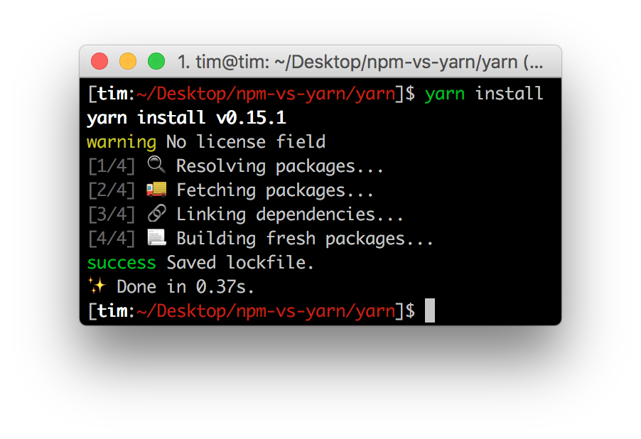

# Yarn vs npm: Everything You Need to Know

# Yarn vs npm：你需要知道的一切


[原文链接](https://www.sitepoint.com/yarn-vs-npm/)

Yarn is a new JavaScript package manager built by Facebook, Google, Exponent and Tilde. As can be read in the [official announcement](https://code.facebook.com/posts/1840075619545360), its purpose is to solve a handful of problems that these teams faced with npm, namely:

Facebook、Google、Exponent 和 Tilde 联合推出了一个新的 JS 包管理工具 — Yarn，正如[官方文档](https://code.facebook.com/posts/1840075619545360)中写的，Yarn 是为了弥补 npm 的一些缺陷而出现的：

+ installing packages wasn’t fast/consistent enough, and
+ npm 安装包（packages）的速度不够快，拉取的 packages 可能版本不同
+ there were security concerns, as npm allows packages to run code on installation.
+ npm 允许在安装 packages 时执行代码，这就埋下了安全隐患

But, don’t be alarmed! This is not an attempt to replace npm completely. Yarn is only a new CLI client that fetches modules from the npm registry. Nothing about the registry itself will change — you’ll still be able to fetch and publish packages as normal.

别慌，Yarn 没想要完全替代 npm，它只是一个新的 CLI 工具，拉取的 packages 依然来自 npm 仓库。仓库本身不会变，所以获取或者发布模块的时候和原来一样。

Should everyone jump aboard the Yarn hype train now? Chances are you never encountered these problems with npm. In this article, we’re going to compare npm and Yarn, so you can decide which is best for you.

那么，是不是所有人都要尽快搭上 Yarn 的车呢？取决于你在使用 npm 时有没有遇到不可忍受的痛点。接下来，我们将会对比 npm 和 Yarn，看完之后，相信你就有了答案。


## Yarn vs npm: Functional Differences

## Yarn vs npm：特性差异

At a first glance Yarn and npm appear similar. As we peek under the hood though, we realize what makes Yarn different.

第一眼看到 Yarn，估计会觉得和 npm 也太像了吧。不过进一步了解 Yarn 之后，我们会发现它的特别之处。

### The yarn.lock File

### yarn.lock 文件

In ```package.json```, the file where both npm and Yarn keep track of the project’s dependencies, version numbers aren’t always exact. Instead, you can define a range of versions. This way you can choose a specific major and minor version of a package, but allow npm to install the latest patch that might fix some bugs.

npm 和 Yarn 都是通过 ```package.json``` 记录项目需要拉取的依赖模块，不过在使用时，往往 ```package.json``` 中模块的版本号不太会写得非常确切，通常是定个版本范围。这样你就能自行选择使用模块的大版本或者小版本，也允许 npm 拉取模块最新的修复了 bug 的版本。

In an ideal world of [semantic versioning](http://semver.org/), patched releases won’t include any breaking changes. This, unfortunately, is not always true. The strategy employed by npm may result into two machines with the same `package.json` file, having different versions of a package installed, possibly introducing bugs.

在理想的[语义化版本](http://semver.org/lang/zh-CN/)世界中，新版是不会有颠覆旧版本的改变，然而现实并非如此。这就导致了使用 npm 拉取依赖时，即使用的是相同的 ```package.json```，在不同的设备上拉到的 packages 版本不一，这就可能为项目引入 bug。

To avoid package version mis-matches, an exact installed version is pinned down in a lock file. Every time a module is added, Yarn creates (or updates) a `yarn.lock` file. This way you can guarantee another machine installs the exact same package, while still having a range of allowed versions defined in `package.json`.

为了防止拉取到不同的版本，Yarn 有一个锁定文件 (lock file) 记录了被确切安装上的模块的版本号。每次只要新增了一个模块，Yarn 就会创建（或更新）```yarn.lock``` 这个文件。这么做就保证了，每一次拉取同一个项目依赖时，使用的都是一样的模块版本。

In npm, the `npm shrinkwrap` command generates a lock file as well, and `npm install` reads that file before reading`package.json`, much like how Yarn reads `yarn.lock` first. The important difference here is that Yarn always creates and updates`yarn.lock`, while npm doesn’t create one by default and only updates `npm-shrinkwrap.json` when it exists.

npm 其实也有办法实现处处使用相同版本的 packages，但需要开发者执行 ```npm shrinkwrap``` 命令。这个命令将会生成一个锁定文件，在执行 ```npm install``` 的时候，该锁定文件会先被读取，和 Yarn 读取 ```yarn.lock``` 文件一个道理。npm 和 Yarn 两者的不同之处在于，Yarn 默认会生成这样的锁定文件，而 npm 要通过 ```shrinkwrap``` 命令生成 ```npm-shrinkwrap.json``` 文件，只有当这个文件存在的时候，packages 版本信息才会被记录和更新。

1. [yarn.lock 文档](https://yarnpkg.com/en/docs/configuration#toc-use-yarn-lock-to-pin-your-dependencies)
2. [npm shrinkwrap 文档](https://docs.npmjs.com/cli/shrinkwrap)

### Parallel Installation

### 并行安装

Whenever npm or Yarn needs to install a package, it carries out a series of tasks. In npm, these tasks are executed per package and sequentially, meaning it will wait for a package to be fully installed before moving on to the next. Yarn executes these tasks in parallel, increasing performance.

无论 npm 还是 Yarn 在执行包的安装时，都会执行一系列任务。npm 是按照队列执行每个 package，也就是说必须要等到当前 package 成功安装之后，才能继续后面的安装。而 Yarn 是同步执行所有任务，提高了性能。

For comparison, I installed the [express](https://www.npmjs.com/package/express) package using both npm and Yarn without a shrinkwrap/lock file and with a clean cache. This installs 42 packages in total.

通过拉取 [express](https://www.npmjs.com/package/express) 依赖，我比较了 npm 和 Yarn 的效率，在没有用任何锁定文件（也就是没有缓存）的前提下，一共安装 42 个依赖：

1. npm 耗时 9 秒
2. Yarn 耗时 1.37 秒

I couldn’t beleive my eyes. Repeating the steps yielded similar results. I then installed the [gulp](https://www.npmjs.com/package/gulp) package, resulting in 195 dependencies.

这耗时……我没法相信自己的眼睛了，反复尝试几次，得到的结果也差不多。于是我又试着安装了有195个依赖的 [gulp](https://www.npmjs.com/package/gulp)，这一次：

1. npm 耗时 11 秒
2. Yarn 耗时 7.81 秒

It seems the difference closely depends on the amount of packages that are being installed. Either way, Yarn is consistently faster.

看来 npm 和 Yarn 在安装包的速度差异和要安装的包个数强相关，不过不管怎么样，Yarn 都比 npm 要快。

### Cleaner Output

### 更简洁的输出 

By default npm is very verbose. For example, it recursively lists all installed packages when running `npm install `. Yarn on the other hand, isn’t verbose at all. When details can be obtained via other commands, it lists significantly less information with appropriate emojis (unless you’re on Windows).

npm 的输出信息比较冗长。在执行 ```npm install <package>``` 的时候，命令行里会不断地打印出所有被安装上的依赖。相比之下，Yarn 简洁太多：默认情况下，结合了 emoji （Windows 上 emoji 不可见）直观且直接地打印出必要的信息，也提供了一些命令供开发者查询额外的安装信息。



## Yarn vs npm: CLI Differences

## CLI 区别

Other than some functional differences, Yarn also has different commands. Some npm commands were removed, others modified and a couple of interesting commands were added.

除了特性上的区别，相比于 npm 的命令，Yarn 命令有增有减还有一些更改。

### yarn global

Unlike npm, where global operations are performed using the `-g` or `--global` flag, Yarn commands need to be prefixed with `global`. Just like npm, project-specific dependencies shouldn’t need to be installed globally.

npm 的全局操作命令要加上 ```-g``` 或者 ``` --global``` 参数，Yarn 的全局命令则需要加上 ```global```。和 npm 类似，项目特定的依赖，就不需要全局安装了。

The `global` prefix only works for `yarn add`, `yarn bin`, `yarn ls` and `yarn remove`. With the exception of `yarn add`, these commands are identical to their npm equivalent.

当执行 ```yarn add```、``` yarn bin```、```yarn ls``` 和 ```yarn remove``` 时添加 ```global``` 前缀才是有全局作用。除了 ```yarn add``` 之外，其他三个命令和 npm 的一样。

1. [yarn global 文档](https://yarnpkg.com/en/docs/cli/global)

### yarn install

### yarn install

The `npm install` command will install dependencies from the `package.json` file and allows you to add new packages. `yarn install` only installs the dependencies listed in `yarn.lock` or `package.json`, in that order.

```npm install``` 命令安装的是 ```package.json``` 中的依赖，如果开发者在 ```package.json``` 中添加了新的依赖，```npm install``` 也一样安装。然而，```yarn install``` 会优先安装 ```yarn.lock``` 中记录的依赖，没有这样的锁定文件时，才会去安装 ```package.json``` 中的依赖。

1. [yarn install 文档](https://yarnpkg.com/en/docs/cli/install)
2. [npm install 文档](https://docs.npmjs.com/cli/install)

### yarn add [–dev]

Similar to `npm install `, `yarn add ` allows you to add and install a dependency. As the name of the command implies, it adds a dependency, meaning it automatically saves a reference to the package in the `package.json` file, just as npm’s `--save` flag does. Yarn’s `--dev` flag adds the package as a developer dependency, like npm’s `--save-dev` flag.

和 ```npm install``` 类似，```yarn add``` 命令允许你添加并安装依赖。通过这个命令添加的依赖都会被自动加到 ```package.json``` 中，和我们在 npm 命令中使用 ```--save``` 参数一样。Yarn 的```-dev``` 则等同于 npm 的 ```--save-dev```。

1. [yarn add 文档](https://yarnpkg.com/en/docs/cli/add)
2. [npm install 文档](https://docs.npmjs.com/cli/install)

### yarn licenses [ls|generate-disclaimer]

At the time of writing, no npm equivalent is available. `yarn licenses ls` lists the licenses of all installed packages. `yarn licenses generate-disclaimer` generates a disclaimer containing the contents of all licenses of all packages. Some licenses state that you must include the project’s license in your project, making this a rather useful tool to do that.

在写这篇文章的时候，npm 没有等同的命令。```yarn licenses ls``` 用于罗列出所有被安装的 package 所持有的执照情况。`yarn licenses generate-disclaimer` 将生成一个对所有依赖的免责声明。有些执照要求开发者一定要在项目中包含这些它们，这个命令就是为这样的场景存在的。

1. [yarn licenses 文档](https://yarnpkg.com/en/docs/cli/licenses)

### yarn why

This command peeks into the dependency graph and figures out why given package is installed in your project. Perhaps you explicitly added it, perhaps it’s a dependency of a package you installed. `yarn why` helps you figure that out.

这条命令能帮助开发者理清安装的 package 之间的关系。拉取了各种依赖以后，有些 package 是你显式安装的，有些包则是递归依赖的。

1. [yarn why 文档](https://yarnpkg.com/en/docs/cli/why)

### yarn upgrade [package]

This command upgrades packages to the latest version conforming to the version rules set in`package.json` and recreates `yarn.lock`. This is similar to `npm update`.

这条命令将根据 ```package.json``` 将 package 升级到最新版本，并更新 ```yarn.lock```，和 ```npm update``` 相似。

Interestingly, when specifying a package, it updates that package to latest release and updates the tag defined in `package.json`. This means this command might update packages to a new major release.

有意思的是，如果指定了 ```[package]``` 参数，Yarn 会将 package 升级到最新版本，并更新 ```package.json``` 中该 package 的版本号字段。

1. [yarn upgrade 文档](https://yarnpkg.com/en/docs/cli/upgrade)

### yarn generate-lock-entry

The `yarn generate-lock-entry` command generates a `yarn.lock` file based on the dependencies set in `package.json`. This is similar to `npm shrinkwrap`. This command should be used with caution, as the lock file is generated and updated automatically when adding and upgrading dependencies via `yarn add` and`yarn upgrade`.

这条命令将会生成一份基于 ```package.json``` 的 ```yarn.lock``` 文件，作用和 ```npm shrinkwrap``` 类似。不过由于执行 `yarn add` and`yarn upgrade` 时都会更新 ```yarn.lock``` 文件，所以要慎重执行 ```yarn generate-lock-entry``` 命令

1. [yarn generate-lock-entry 文档](https://yarnpkg.com/en/docs/cli/generate-lock-entry)
2. [npm shrinkwrap 文档](https://docs.npmjs.com/cli/shrinkwrap)


## Stability and Reliability

## 稳定性和可依赖度

Could the Yarn hype train become derailed? It did receive a lot of [issue reports](https://github.com/yarnpkg/yarn/issues) the first day it was released into the public, but the rate of resolved issues is also astounding. Both indicate that the community is working hard to find and remove bugs. Looking at the number and type of issues, Yarn appears stable for most users, but might not yet be suitable for edge cases.

看到 Yarn 刚发布时长长的 [issue 列表](https://github.com/yarnpkg/yarn/issues)，真的很担心上了一辆灵车…但大家也可以看到问题解决的速度之快，令人震惊。可以感受到 Yarn 社区确实在攻克 bug，从问题列表上也能发现 Yarn 大部分 bug 发生在边界情况下，其实对于大多数开发者而言，Yarn 已经足够稳定了。

Note that although a package manager is probably vital for your project, it is just a package manager. If something goes wrong, reinstaling packages shouldn’t be difficult, and nor is reverting back to npm.

虽然现在包管理工具在一个项目中扮演着不可或缺的角色，但它仅仅是个包管理工具。如果拉取的依赖出了问题，大可以重新拉取或者干脆用 npm 再安装看看。

## The Future

## 未来

Perhaps you’re aware of the history between Node.js and io.js. To recap: io.js was a fork of Node.js, created by some core contributors after some disagreement over the project’s governance. Instead, io.js chose an open governance. In less than a year, both teams came to an agreement, io.js was merged back into Node.js, and the former was discontinued. Regardless of the rights or wrongs, this introduced a lot of great features into Node.js.

可能你想到了 Node.js 和 io.js 的爱恨情仇：io.js 源自 Node.js 的一个分支，它的领导者是原来 Node.js 的一些核心开发者，几位核心开发者和 Node.js 的管理者产生了一些分歧，所以开启了一个新的分支，不同于 Node.js，io.js 采用的是开放管理。不过一年不到，io.js 又合并回 Node.js 中，开发者们也不再更新 io.js。不去评论 io.js 的出走是对是错，我们知道的是现在 Node.js 有了更多非常好的特性。

I’m seeing similar patterns with npm and Yarn. Although Yarn isn’t a fork, it improves several flaws npm has. Wouldn’t it be cool if npm learned from this and asked Facebook, Google and the other Yarn contributors to help improve npm instead? Although it is way too early to say if this will happen, I hope it will.

在 npm 和 Yarn 上我看到了当初 Node 和 io 的影子，虽然 Yarn 之于 npm 并不是分支之于主干的关系，但它确实弥补了 npm 的一些缺陷。如果 npm 能邀请 Facebook、Google 以及其他的 Yarn 社区推动者一同来改进 npm 不是很好吗？虽然现在提这个为时尚早，但我真心希望 npm 能这么做。

Either way, Yarn’s future looks bright. The community appears excited and is receiving this new package manager well. Unfortunately, no road map is available, so I am not sure what surprises Yarn has in store for us.

现在看起来，Yarn 的未来一片光明。开发者们很期待这个新工具，也认可它作为一个包管理工具的能力。不过 Yarn 发展方向并没有很明确，我也不确定将会有什么新的特性。

## Conclusion

## 结论

Yarn scores points with way better defaults compared to npm. We get a lockfile for free, installing packages is blazing fast and they are automatically stored in `package.json`. The impact of installing and using Yarn is also minimal. You can try it on just one project, and see if it works for you or not. This makes Yarn a perfect drop-in substitute for npm.

目前看来 Yarn 要比 npm 更好用：默认就有锁定文件、更快速地安装依赖以及依赖的更新会自动同步到 ```package.json``` 文件中。从 npm 迁移到 Yarn 成本几乎为零，你大可以在一个项目里用用看，感受下它是否适合你。以上优点都让 Yarn 成为了目前 npm 最好的替代品。

I would definitely recommend trying Yarn on a single project sooner or later. If you are cautious about installing and using new software, give it a couple of months. After all, npm is battle-tested, and that is definitely worth something in the world of software development.

我非常鼓励大家尽快在项目中用起 Yarn。不过如果你是一个对新工具相当谨慎的人，也可以等多两三个月再去尝试。毕竟 npm 才是久经沙场的老将。

If you happen to find yourself waiting for npm to finish installing packages, that might be the perfect moment to read the [migration guide](https://yarnpkg.com/en/docs/migrating-from-npm) ;)

如果你发现自己花费在等待 npm 安装依赖上的时间实在太久了，那是时候试试看 Yarn 了，不如先从[迁移文档](https://yarnpkg.com/en/docs/migrating-from-npm)开始吧。

What do you think? Are you using Yarn already? Are you willing to give it a try? Or is this just contributing to the further fragmentation of an already fragmented ecosystem? Let me know in the comments below.

你对 Yarn 怎么看的？是不是已经用起了 Yarn？还是尚未使用但已经想试试看了？又或者觉得 Yarn 只是历史进程中的一步？在[这篇文章](https://www.sitepoint.com/yarn-vs-npm/)下留言吧，让我们一起来讨论 Yarn。


